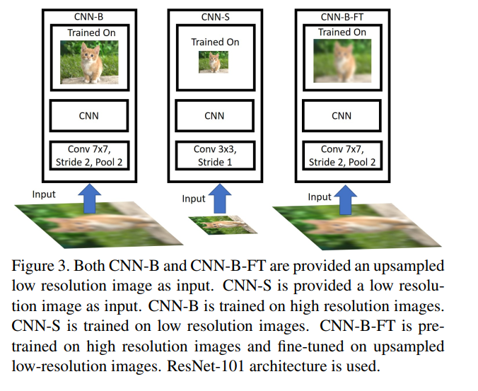
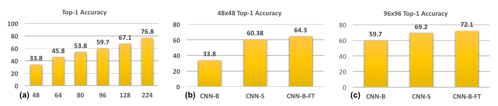
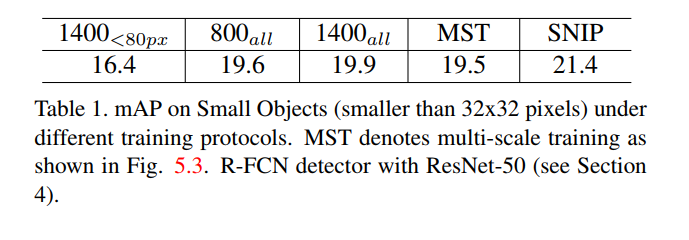

# CNN-3
~~The test to the networks in SNIP which are CNN-B 、CNN-S 、CNN-B-FT~~

~~搞错啦，之前那个不太能做的样子。~~（**尴尬了，还是可以在COCO数据集上做的呢，或许这会是后面时间的工作(๑•́ ₃ •̀๑)**）

现在搞得是SNIP中关于table 1. 的实验内容。

**最新进展**

实验的代码已经完成啦，现在正在跑呢，跑完的话这一个仓库的就要关闭了，同时有一些东西也要移交到新的仓库里面来完成新的想法了。